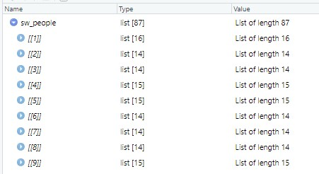
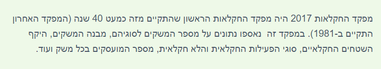

```{r child = "setup.Rmd"}
```

### Welcome

Welcome to Assignment 2 in R!

Remember:

* You can play with the assignment in Playground mode, but:
* Only your private Github repository assigned to you by the course admin will be cloned and graded (Submission mode, see instructions [here](https://github.com/DSApps-2023/Class_Slides/blob/master/Apps_of_DS_HW.pdf))
* Like any other University assignment, your work should remain private
* You need to `git clone` your private Github repository locally as explained [here](https://github.com/DSApps-2023/Class_Slides/blob/master/Apps_of_DS_HW.pdf)
* You need to uncomment the starter code inside the chunk, replace the `### YOUR CODE HERE ###`, run the chunk and see that you're getting the expected result
* Pay attention to what you're asked to do and the required output
* For example, using a *different* function than the one you were specifically asked to use, will decrease your score (unless you amaze me)
* Your notebook should run smoothly from start to end if someone presses in the RStudio toolbar Run --> Restart R and Run All Chunks
* When you're done knit the entire notebook into a html file, this is the file that would be graded
* You can add other files but do not delete any files
* Commit your work and push to your private Github repository as explained [here](https://github.com/DSApps-2023/Class_Slides/blob/master/Apps_of_DS_HW.pdf)

This assignment is due: 26/4 23:59

### Packages

These are the packages you will need. If you don't have them, you need to uncomment the `install.packages()` line and install them first (you can also just copy this command to the R console and do it there if you don't want all the output printed in this notebook).

When you load the packages you may see different kinds of messages or warnings, skim them:

```{r}
# install.packages(c("tidyverse", "repurrrsive")) # readxl should be installed with tidyverse
library(tidyverse)
library(readxl)
library(repurrrsive)
```

### Tidying Data

##### (40 points)

Go over the [UN Migration Dataset](https://DSApps-2023.github.io/Class_Slides/u1_d03-wranglingB/u1_d03-wranglingB.html#25) we've talked about in class.
 
Open the Excel file in this repo's data folder and see for yourself how untidy an official dataset can get. If you don't have Excel look again at the [screenshot](https://DSApps-2023.github.io/Class_Slides/u1_d03-wranglingB/u1_d03-wranglingB.html#26) from class.

In this part of the assignment you will recreate the steps needed to get to the (almost) tidy `migration` dataset you can find in the [class repo](https://github.com/DSApps-2023/Class_Slides/tree/master/data).

First read in the 3rd sheet of this Excel file (a.k.a "Table 2. Male migrant stock at mid-year..."), with the [`read_excel()`](https://readxl.tidyverse.org/reference/read_excel.html) function from the `readxl` package:

```{r}
dirty_data <- read_excel("data/UN_MigrantStockByOriginAndDestination_2019.xlsx", sheet = 3)
```

If you look at what you got (e.g. with `View(dirty_data)` in RStudio) you would be appalled. Hopefully you would then reach the conclusion you do not need the first 15 rows. Find out how to read the sheet **again** skipping the first 15 rows.

```{r}
#view(dirty_data)
dirty_data <- read_excel("data/UN_MigrantStockByOriginAndDestination_2019.xlsx", sheet = 3, skip = 15)
```

The data looks much better, but still. R missed the names of the first few columns (because they appear in merged cells!) so we need to change them:

```{r}
colnames(dirty_data)[1:6] <- c("year", "order", "country", "notes", "code", "type_of_data")
```

Next look at some of the countries column names:

```{r}
colnames(dirty_data)[c(13, 17, 34, 61)]
```

These are definitely not acceptable R column names, we see spaces, parentheses, French letters, and other issues. Usually you might be able to use the `make_clean_names()` function from the [`janitor`](http://sfirke.github.io/janitor/) package, but for out-of-scope reasons it won't work here.

Read the `clean_country_name()` function and use it to clean the column names of the data:

```{r}
clean_country_name <- function(name) {
  str_replace_all(str_replace_all(str_to_lower(name), " |-", "_"), "'|,|\\(|\\)", "")
}

colnames(dirty_data) <- clean_country_name(colnames(dirty_data))
```

You should see the problematic column names improved (though not perfect):

```{r}
colnames(dirty_data)[c(13, 17, 34, 61)]
```

Another issue with this dataset is that many of the rows are simply subtotals of the number of immigrants per specific area, e.g. row 1 (17 in the original Excel sheet) is the total for the entire world. Luckily there is a way to exclude all such rows, with the `code` column, filter only rows with code smaller than 900:

```{r}
dirty_data <- dirty_data %>% filter(code < 900)
```

While you're at it, we don't need columns `c(4, 6, 7, 8, 9)`:

```{r}
dirty_data <- dirty_data[,-c(4, 6, 7, 8, 9)]
```

Check you have a table with 1624 rows and 236 columns.

```{r}
dim(dirty_data)
```

Now let's use the `clean_country_name()` to also clean the `country` column:

```{r}
 dirty_data <- dirty_data %>%
  mutate(country = clean_country_name(country))
```

There are different values for missing values as said in class and we are going to assume `NA` means 0 migration:

```{r}
dirty_data <- dirty_data %>%
  mutate(across(where(is.character), ~na_if(., "-"))) %>%
  mutate(across(where(is.character), ~na_if(., ".."))) %>%
  replace(is.na(.), "0")
```

Finally, you may be shocked to know that all country columns (all but the first 4 columns) which contain the **number** of migrants from the row country to the column country, are actually `character` columns! Convert them `as.numeric`:

```{r}
dirty_data <- dirty_data %>%
  mutate(across(-c("year","order","country","code"), as.numeric))
```

A big problem is that `dirty_data` now holds only the data for men. We can't just copy-paste everything, we need a function. Moreover, many of the steps could be united into a single pipe.

Complete the `tidy_up_data()` function, which receives a `.sheet` number and a `.gender` string, and returns the (almost) tidy data for that gender. Uncomment the usage of the function to get the `migration_men` and `migration_women` datasets. Bonus points if you can wrap `clean_country_name()`  inside a function called `clean_country_name_data()` to clean the names of the dataset **inside a pipe**, not as done above. Also notice there is no `country_dest` column, I want you to rename the `country` column.

```{r}
tidy_up_data <- function(.sheet, .gender) {
  dirty_data <- read_excel("data/UN_MigrantStockByOriginAndDestination_2019.xlsx", sheet = .sheet, skip = 15)
  colnames(dirty_data)[1:6] <- c("year", "order", "country", "notes", "code", "type_of_data")
  dirty_data %>%
    rename(country_dest = country) %>%
    mutate(gender = .gender) %>%
    select(gender, year, code, country_dest, everything())
}

# Usage
migration_men <- tidy_up_data(3, "men")
migration_women <- tidy_up_data(4, "women")
```

Bind the two datasets with the `bind_rows()` function and you have the `migration` dataset we used in class. You can save it as a R object with the `write_rds()` function:

```{r}
migration <- bind_rows(migration_men, migration_women)

write_rds(migration, "data/migration.rds")
```

Be sure to use `pivot_longer()` and `pivot_wider()` as we did in class to go back and forth between wide and long formats:

```{r}
migration_long <- migration %>%
  pivot_longer(cols = -c(1:5),
               names_to = "country_orig",
               values_to = "n_migrants")
migration_long
```

```{r}
migration_wide <- migration_long %>%
  pivot_wider(id_cols = 1:5,
              names_from = country_orig,
              values_from = n_migrants)
migration_wide
```

### Iterating with `purrr` - intro

##### (0 points)

Remember the Starwars datasets from class?

```{r}
sw_tables <- read_rds("data/sw_tables.rds")
characters <- sw_tables$characters
planets <- sw_tables$planets
films <- sw_tables$films

# For example the characters table:
characters %>%
  select(character_id, name, gender, hair_color, film_id) %>%
  head(7)
```

Yes, well, the sad truth is that often data do not come in such a ready-made, easy-to-use, way. The Starwars datasets actually come from [SWAPI](https://swapi.co/), which is an API which lets you query the Starwars dataset, located at a distant server, and get results in JSON format, which is basically a nested list (a list of lists of lists etc.). Feel free to explore it online, have a look at other APIs like the [Chuck Norris Jokes](https://api.chucknorris.io/) API.

The raw Starwars lists are found in the `repurrrsive` package:

* `sw_people`
* `sw_films`
* `sw_planets`
* `sw_species`
* `sw_vehicles`
* `sw_starships`

For example to explore the `sw_people` list interactively in RStudio:

```{r, eval=FALSE}
# Do not change the "eval=FALSE" chunk option!
View(sw_people)
```



Each element of the list is a SW character, and in itself is a list of *varying* length of attributes.

For example, Luke Skywalker has the attribute "gender":

```{r}
sw_people[[1]][c("name", "gender")]
```

C-3PO has this attribute but it is marked with a string "n/a":

```{r}
sw_people[[2]][c("name", "gender")]
```

Luke also has an attribute called "vehicles" which in itself is a list of vehicles "ID"s:

```{r}
sw_people[[1]]$vehicles
```

But C-3PO does not:

```{r}
sw_people[[2]]$vehicles
```

Notice in R this does not return an error, but `NULL`.

Now. Let us use `purrr` to reconstruct a **table** out of this nested list, similar to what l used in class.

Getting all SW characters names from `sw_people` can easily be done with `map` if you want a list or `map_chr` if you want a vector:

```{r}
map_chr(sw_people, "name")
```

Try the same with "height" and `map_dbl` because you'd expect height to be numeric:

```{r, error=TRUE}
map_dbl(sw_people, "height")
```

If you map "height" as a string you would soon see why is that:

```{r}
map_chr(sw_people, "height")
```

We could take a general approach like this:

```{r}
chars <- tibble(name = map_chr(sw_people, "name"),
                   gender = map_chr(sw_people, "gender"),
                   height = map_chr(sw_people, "height"))
chars
```

But this would tire us out fast, and can be quite slow with large lists (mapping the same large list over and over again, each time for a single attribute). What I usually do is write a function extracting each "row" out of a list element, then use `map_dfr()` to map all list elements with my function to a data.frame:

```{r, eval = FALSE}
get_sw_person_details <- function(person) {
  list(
    name = person$name,
    gender = person$gender,
    height = person$height
  )
}

chars <- sw_people %>% map_dfr(get_sw_person_details)
chars
```

But this didn't really solve the problem, we're still manually iterating over attributes.

You should know the `pluck()` and `chuck()` functions from `purrr` for extracting a single element of a list:

```{r}
l = list(a = 1)

pluck(l, "a")
chuck(l, "a")
```

```{r, error=TRUE}
pluck(l, "b")
chuck(l, "b")
```

As you can see `chuck()` is **safer** as it returns an error in case the element does not exist.

If you want to be a bit more concise (and if you have many attributes) you could use a vector of attributes `c("name", "gender", "height")` and map a function like `pluck()` or `chuck()` to get all attributes. I will use `chuck()`:

```{r}
char_attrs <- c("name", "gender", "height", "mass")

get_sw_element_details <- function(element, attrs) {
  element_list <- map(attrs, function(attribute) chuck(element, attribute))
  names(element_list) <- attrs
  element_list
}

chars <- sw_people %>% map_dfr(get_sw_element_details, char_attrs)
chars
```

Do you see why this function is much less prone to future bugs and much more usable in the future, e.g. with `sw_films`?

But what will happen once we add in an attribute which not all SW characters have, like "species"?

```{r, error=TRUE}
char_attrs <- c(char_attrs, "species")

chars <- sw_people %>% map_dfr(get_sw_element_details, char_attrs)
```

Because "species" and other attributes do not appear for all SW characters `chuck()` throws an error.

We can make a safer version of `chuck()` by using one of `purrr`'s wrapper functions, e.g. `possibly()`, which lets you specify a value to be returned in case of an error:

```{r}
chuck_safely <- possibly(chuck, otherwise = NA)

get_sw_element_details <- function(element, attrs) {
  element_list <- map(attrs, function(attr) chuck_safely(element, attr))
  names(element_list) <- attrs
  element_list
}

chars <- sw_people %>% map_dfr(get_sw_element_details, char_attrs)
chars
```

We're still not done! Look what happens when we add "vehicles":

```{r, error=TRUE}
char_attrs <- c(char_attrs, "vehicles")

chars <- sw_people %>% map_dfr(get_sw_element_details, char_attrs)
```

In previous versions of tidyverse this resulted in an error, because the "vehicles" field is in itself a list of a few vehicles "ID"s, which threw `map_dfr()` off the rails, where we *would* have wanted a list column (column holding lists of varying length of vehicles). In the most recent version it silently un-nests the vehicles from each list into multiple rows, which I think is worse, but it is debatable.

Here we have a few options. I prefer keeping a **named** vector of `chars_attrs` (like a Python dictionary), specifying for each attribute whether a list is expected or not, then choosing what to do with such attribute in another function, `chuck_safest()`:

```{r}
char_attrs <- c("name" = FALSE, "gender" = FALSE, "height" = FALSE, "mass" = FALSE, "species" = FALSE, "vehicles" = TRUE)

chuck_safest <- function(element, attr, attrs_dict) {
  res <- chuck_safely(element, attr)
  if (attrs_dict[attr]) {
    return(list(res))
  }
  return(res)
}
get_sw_element_details <- function(element, attrs_dict) {
  attrs <- names(attrs_dict)
  element_list <- map(attrs, function(attr) chuck_safest(element, attr, attrs_dict))
  names(element_list) <- attrs
  element_list
}

chars <- sw_people %>% map_dfr(get_sw_element_details, char_attrs)
chars
```

Look at the `vehicles` column. It is a list column, as we wanted, but we can see that some lists are marked "<chr[2]>" and some "<lgl[1]>", which means some are of type "character" and some "logical". This happens because the `NA` value returned by `chuck_safely` has by default type "logical"!

```{r}
typeof(NA)
```

And so one final touch would be to make `chuck_safely()` return a "character" `NA` explicitly, like so:

```{r}
chuck_safely <- possibly(chuck, otherwise = NA_character_)
```

And now:

```{r}
chars <- sw_people %>% map_dfr(get_sw_element_details, char_attrs)
chars
```

### Iterating with `purrr` - what you need to do

##### (50 points)

First, from the `sw_films` list, create a `films` data.frame, holding for each SW film a single row with variables `c("title", "episode_id", "director", "release_date", "characters", "planets", "starships" and "vehicles")`. Notice:

* some of these variables have a single element, some are vectors of elements
* there's *very* little you need to do if you followed along and you don't rewrite functions already written...

```{r}
char_attrs <- c("title"= FALSE, "episode_id"= FALSE, "director"= FALSE, "release_date"= FALSE, "characters"= TRUE, "planets"= TRUE, "starships"= TRUE, "vehicles"= TRUE)

films <- sw_films %>% map_dfr(get_sw_element_details, char_attrs)
films
```
Now, the `chars` dataset isn't perfect:

* Redo it, adding variables "birth_year", "homeworld" and "films"
* Missing values still appear as "n/a" or "unknown" - they need to be `NA`
* Columns `height` and `mass` are still of type `character` - they need to be `numeric`
* Change column "homeworld" to have its integer ID rather than the entire planet URL (e.g. instead of "http://swapi.co/api/planets/1/" there should be 1)
* Bonus: can you do this for each of the "films" list?
* The "birth_year" column holds string values such as "19BBY". It should be just "19" and numeric.
* Add a column `character_id` numbering each character from 1 to last, and make it the *first* column of the dataset

You may write functions to help you but I would prefer if the actual cleaning would be performed in a single pipe.

You must use at least one `purrr` mapping function such as `map_dbl()`.

```{r}
char_attrs <- c("name" = FALSE, "gender" = FALSE, "height" = FALSE, "mass" = FALSE, "species" = FALSE, "vehicles" = TRUE, "birth_year" = FALSE, "homeworld" = FALSE, films = TRUE)
chars <- sw_people %>% map_dfr(get_sw_element_details, char_attrs)

chars <- chars %>% 
  mutate(
    across(c(height, mass), ~if_else(. %in% c("n/a", "unknown"), NA_real_, as.numeric(.))),
    gender = if_else(gender %in% c("n/a", "unknown"), NA_character_, gender),
    homeworld = gsub("[^0-9]+", "", homeworld),
    birth_year = gsub("[^0-9]+", "", birth_year),
    character_id = row_number()
  ) %>% 
  select(character_id, everything())

chars
```

```{r}
# bonus: change films
chars %>% mutate(films = (gsub("[^0-9]+", "", films))) 
```


Finally, I just want you to acknowledge the fact that we didn't use a single for loop. For loops are not necessarily "bad" or "slow" but there are available solutions like `purrr`, that allow you to write more concise, less error-prone code. Make yourself love it, it will pay off.

### Paper questions

##### (10 points)

Read Broman and Woo [Data Organization in Spreadsheets](https://www.tandfonline.com/doi/full/10.1080/00031305.2017.1375989) 2017 paper. It is actually one of The American Statistician journal most viewed papers.

Look at the משקים חקלאיים attached Excel file in the data folder. This is an actual file from the Israeli Central Bureau of Statistics, and reflects quite well how files originating from the CBS usually look like.



Which Broman and Woo principles are violated in this file? Give at least 4 and explain each. You can add a few from your own experience if you like.

```{r}
# principle 1: Choose Good Names for Things
# explanation - the names of the observations contain spaces, for example "jewish - other"

# principle 2: no empty cells 
# explanation - D11 is an empty cell

# principle 3: create a data dictionary
# explanation - the data does not have a separate file that explains what all of the variables are.

# principle 4: Do Not Use Font Color or Highlighting as Data
# explanation - all of the districts rows are highlighted
```

### Wrap up

And that's it, you have shown you can clean a messy Excel sheet and tidy up a complex JSON API list into a nice table you can actually analyze. Good luck with the rest of the course!
